# Advanced Modular **DataTable** 🎛️


> **A lightweight, plugin‑driven JavaScript/TypeScript library for building high‑performance, feature‑rich data grids.**

---

## ✨ Preview


---

## 📚 Table of Contents  
- [Key Features](#key-features)  
- [Quick Start](#quick-start)  
- [Basic Usage](#basic-usage)  
- [Configuration Options](#configuration-options)  
- [Programmatic API](#programmatic-api)  
- [Custom Events](#custom-events)  
- [Styling](#styling)  
- [Responsive Columns](#responsive-columns)
- [Architecture](#architecture)  
- [Roadmap & Changelog](#roadmap--changelog)

---

## 🚀 Key Features

| | Feature | Description |
|:-:|:--|:--|
| 🔢 | **Tabular Rendering** | Virtualised, blazing‑fast rendering of **large data sets**. |
| ↕️ | **Client‑Side Sorting** | Single or multi‑column sort with visual indicators. |
| 🔍 | **Global Search** | Instant, debounce‑controlled fuzzy search across all rows. |
| 🧩 | **Per‑Column Filters** | Text, number, date & multi‑select pop‑ups with advanced operators. |
| 📄 | **Pagination** | Simple, numbered or **numbered‑jump** modes with pre‑fetching of the next page. |
| ☑️ | **Row Selection** | Single/Multiple selection with persistent state & public API. |
| 🛠️ | **Row Actions** | Easily attach custom buttons (edit, delete, …) to each row. |
| 📏 | **Resizable Columns** | Drag & double‑click to resize or auto‑fit. |
| 🪢 | **Column Reorder** | Drag‑and‑drop any header to change order. |
| 📤 | **Data Export** | Export current view to **CSV**, **Excel (.xlsx)** or **PDF**. |
| 💾 | **State Persistence** | Automatic save/restore via `localStorage`. |
| ⌛ | **Loading Overlay** | Full‑table overlay for async operations. |
| 🖌️ | **Custom Cell Renderers** | Provide a render callback per column for total flexibility. |
| 🖼️ | **Swappable Icons** | Uses SVG sprites via `<use>` with automatic inline fallback. |
| 📱 | **Responsive Visibility** | Show/hide columns based on screen breakpoints.
| 🔗 | **Fluent API & Events** | Rich programmatic API and granular custom events. |

---

## ⚡ Quick Start

```bash
# 1. Install
npm install advanced-datatable

# 2. Build / dev‑server
npm run build       # compiles TS → /dist
npm run dev         # live‑reload (vite / webpack‑dev‑server)

# 3. Open the demo
open examples/index.html     # or serve ./examples via any static server
```

> **Dependencies**: `exceljs`, `jspdf`, `jspdf-autotable` are **peer‑optional** – install them to unlock full export support.

---

## 🏗️ Basic Usage

```html
<!DOCTYPE html>
<html lang="en">
<head>
  <meta charset="UTF-8" />
  <title>Advanced DataTable</title>
  <link href="https://cdn.jsdelivr.net/npm/tailwindcss@^3/dist/tailwind.min.css" rel="stylesheet" />
  <!-- Optional: SVG sprite with your custom icons -->
  <!-- <svg style="display:none"> … </svg> -->
</head>
<body class="p-6 bg-gray-50">
  <div id="usersTable"></div>

  <script type="module">
    import { DataTable } from "./dist/index.js";

    const columns = [
      { title: "ID",   type: "number" },
      { title: "Name", type: "string" },
      { title: "Email",type: "mail",  textAlign: "left" },
      { title: "Salary",type: "money", locale: "en-US", currency: "USD" }
    ];

    // fetch() CSV example
    const raw = await fetch("/data/users.csv").then(r => r.text());
    const data = raw.split("\n").map(r => r.split(","));

    const table = new DataTable("usersTable", {
      columns,
      data,
      pagination:  { enabled: true, rowsPerPage: 15 },
      sorting:     { enabled: true },
      searching:   { enabled: true, debounceTime: 200 },
      selection:   { enabled: true, mode: "multiple" },
      exporting:   { csv: true, excel: true, pdf: true },
      columnFiltering: { enabled: true },
      resizableColumns: true,
    });

    table.on("dt:actionClick", ({ detail }) => console.log("Clicked", detail));
  </script>
</body>
</html>
```

---

## ⚙️ Configuration Options

<details>
<summary>Click to expand full <code>DataTableOptions</code> interface</summary>

```ts
interface DataTableOptions {
  columns: ColumnDefinition[];                 // required
  data: any[][];                              // initial data
  uniqueRowIdColumn?: number | string;        // default = 0
  pagination?: PaginationOptions;
  sorting?:   { enabled: boolean };
  searching?: { enabled: boolean; debounceTime?: number };
  selection?: {
    enabled: boolean;
    mode?: 'single' | 'multiple';
    initialSelectedIds?: any[];
  };
  exporting?: {
    csv?:   boolean | CsvExportOptions;
    excel?: boolean | ExcelExportOptions;
    pdf?:   boolean | PdfExportOptions;
  };
  columnFiltering?: { enabled: boolean; showClearButton?: boolean };
  rowActions?: RowAction[];
  actionsColumn?: { header?: string; width?: string };
  stateManagement?: { persist?: boolean; prefix?: string };
  resizableColumns?: boolean;
  processingMode?: 'client' | 'server';       // default = 'client'
  serverSideTotalRows?: number;               // required if processingMode = 'server'
  serverSide?: {
    fetchData?: (params: ServerSideParams) => Promise<{ data: any[][]; totalRecords: number }>;
  };
  loadingMessage?: string;                    // default = "Loading…"
  icons?: Partial<IconIds>;                   // override sprite IDs
}
```

</details>

> **Tip**: every option is documented in `docs/api.md` with full TypeScript definitions & examples.

---

## 🛠️ **Options Reference**

Every option available in **`DataTableOptions`** is described below. The defaults refer to the client‑side processing mode.

| Option | Type | Default | Description |
| :-- | :-- | :-- | :-- |
| `columns` | `ColumnDefinition[]` | — | **Required.** Declarative definition of each column's header, data type, formatting rules and filtering behaviour. |
| `data` | `any[][]` | `[]` | Initial row data. Each nested array is a row; cells are accessed by column index. |
| `uniqueRowIdColumn` | `number \| string` | `0` | Index **or** column `name` whose value is treated as the row's primary key. Used for selection, updates & persistence. |
| `pagination` | `PaginationOptions` | `{ enabled:false }` | Enables paging and fine‑grained control over its UI. |
| `sorting` | `{ enabled:boolean }` | `{ enabled:false }` | Master switch for client‑side sorting (single or multi‑column depending on UI). |
| `searching` | `{ enabled:boolean; debounceTime?:number }` | `{ enabled:false }` | Turns on global text search. `debounceTime` throttles keystrokes (ms). |
| `selection` | `{ enabled:boolean; mode?:'single'\|'multiple'; initialSelectedIds?:any[] }` | `{ enabled:false }` | Row‑selection module. `initialSelectedIds` pre‑selects rows. |
| `exporting` | `{ csv?:boolean\|CsvExportOptions; excel?:boolean\|ExcelExportOptions; pdf?:boolean\|PdfExportOptions }` | — | Show *Export* dropdown. Pass an object to tweak filename, delimiter, sheet name, PDF orientation, … |
| `columnFiltering` | `{ enabled:boolean; showClearButton?:boolean }` | `{ enabled:false }` | Toggles column‑level filter pop‑ups. `showClearButton` adds a *Clear* CTA inside each popup. |
| `rowActions` | `RowAction[]` | `[]` | Array of buttons rendered inside the *actions* column for every row. |
| `actionsColumn` | `{ header?:string; width?:string }` | `{ header:"Actions", width:"auto" }` | Change the header label or fixed width of the actions column. |
| `stateManagement` | `{ persist?:boolean; prefix?:string }` | `{ persist:false, prefix:"dt_" }` | Automatic save / restore of paging, sorting, filters, column order & widths using `localStorage`. |
| `resizableColumns` | `boolean` | `false` | Makes all columns resizable **unless** a column overrides `resizable:false`. |
| `processingMode` | `'client' \| 'server'` | `'client'` | Switches between built‑in data processing and remote/virtual data. |
| `serverSideTotalRows` | `number` | — | **Required in `'server'` mode.** Total rows available on the backend – used to compute total pages. |
| `serverSide` | `{ fetchData:(params)=>Promise<{data:any[][]; totalRecords:number}> }` | — | Async hook that must resolve the next page slice when paging / sorting / filtering. |
| `loadingMessage` | `string` | "Loading…" | Text shown inside the translucent loading overlay. |
| `icons` | `Partial<IconIds>` | defaults in code | Override SVG sprite IDs (`sortArrow`, `filter`, …). |

### `ColumnDefinition`

| Property | Type | Default | Description |
| :-- | :-- | :-- | :-- |
| `title` | `string` | — | **Required.** Header label. |
| `type` | `'string' \|'number' \|'date' \|'mail' \|'tel' \|'money'` | `'string'` | Influences sorting, filter UI & formatting. |
| `width` | `string` | "auto" | Initial CSS width (`px`, `%`, `rem`…). |
| `sortable` | `boolean` | `true` | Disable per‑column to exclude from sorting even when global sorting is enabled. |
| `searchable` | `boolean` | `true` | Exclude this column from global search while keeping others. |
| `resizable` | `boolean` | inherits `resizableColumns` | Opt‑out of header drag‑resize just for this column. |
| `textAlign` | `'left' \|'center' \|'right' \|'justify'` | `'left'` | Cell text alignment. |
| `render` | `(cell,row,rowIndex,cellEl)=>string \| Node \| void` | — | Custom renderer – return HTML or mutate `cellEl` directly. |
| `filterType` | `'text' \|'number' \|'date' \|'multi-select'` | inferred from `type` | Force a specific filter UI. |
| `filterOptions` | `(string \| {value:any;label:string})[]` | — | Pre‑defined values for multi‑select filter. |
| `filterPlaceholder` | `string` | — | Placeholder for text/number/date filter input. |
| `filterOperators` | narrowed operator enum | full operator set | Restrict operator dropdown (e.g. only `equals`, `contains`). |
| `locale` | `string` | browser locale | For money & date formatting. |
| `currency` | `string` | "USD" | ISO 4217 code used when `type:'money'`. |
| `name` | `string` | — | Stable identifier (string) alternative to numeric index. |
| `data` | `string` | — | (Planned) dot‑path into object rows instead of array rows. |

### `PaginationOptions`

| Option | Type | Default | Description |
| :-- | :-- | :-- | :-- |
| `enabled` | `boolean` | `false` | Master switch for the pagination plugin. |
| `rowsPerPage` | `number` | `10` | Visible rows per page. |
| `rowsPerPageOptions` | `number[]` | `[10,25,50,100]` | Presets for the *rows‑per‑page* selector; omit to hide selector. |
| `style` | `'simple' \|'numbered' \|'numbered-jump'` | `'numbered-jump'` | Choose a pager layout.
| `previousButtonContent` | `string` | « ◀ » icon | Custom HTML for *Prev* button (glyph, SVG, text…). |
| `nextButtonContent` | `string` | « ▶ » icon | Same for *Next* button. |
| `jumpButtonText` | `string` | "Go" | Caption on the page‑jump submit button.

> 🛈 Most nested option objects accept either a **boolean** (simple on/off) or a **detailed object** for fine‑tuning.

## 🔌 Programmatic API

```ts
const table = new DataTable("el", options);

table.setLoading(true);
table.setData(newDataArray);
table.addRow([3, "Jane", "jane@mail.com"]);
...
```

| Category | Methods |
|:--|:--|
| **Data** | `setData`, `addRow`, `updateRowById`, `deleteRowById`, `refreshData` |
| **Paging** | `setPage`, `goToPage`, `getState` |
| **Sorting & Filters** | `setSort`, `setColumnFilter`, `clearAllFilters` |
| **Selection** | `setSelectedRowIds`, `getSelectedRowIds`, `getSelectedRowData` |
| **Lifecycle** | `render`, `destroy`, `setLoading` |

---

## 📣 Custom Events

All events are emitted from `table.element` and carry details under `event.detail`.

| Event | Fires when… | detail |
|:--|:--|:--|
| `dt:renderComplete` | the table (re)renders | `{ mode: 'create' | 'update' }` |
| `dt:pageChange` | current page / rowsPerPage changes | `{ currentPage, rowsPerPage }` |
| `dt:sortChange` | sort order changes | `{ sortColumnIndex, sortDirection }` |
| `dt:search` | global search term changes | `{ searchTerm }` |
| `dt:filterChange` | any column/global filter mutates | `{ type: 'column' | 'global' | 'clearAll' }` |
| `dt:actionClick` | a row‑action button is pressed | `{ actionId, rowData, rowId, rowIndex }` |
| `dt:selectionChange` | row selection changes | `{ selectedIds, selectedData }` |
| `dt:columnResize` | user resizes a column | `{ columnIndex, newWidth }` |
| `dt:columnReorder` | column header is dragged | `{ columnOrder }` |
| `dt:loadingStateChange` | `setLoading` toggles | `{ isLoading }` |
| `dt:error` | any async or server error | `{ message, error? }` |

---

## 🎨 Styling

The default theme is built with **TailwindCSS** utility classes. You can:

1. Include Tailwind in your build (recommended).  
2. Swap the utility classes in `src/**/*.ts` with your framework of choice.  
3. Override styles in your own CSS (see `src/datatable-styles.css` for non‑Tailwind rules such as column resize handles).

---

## 📱 Responsive Columns

This DataTable includes a `ColumnVisibilityController` to dynamically show or hide columns based on screen size.

**Usage:**

1. **Ensure Columns Have `field`:** Define a unique `field` property in your `ColumnDefinition` for columns you want to control.

    ```javascript
    const columns = [
      { title: "ID", field: "id", type: "number" },
      { title: "Name", field: "name", type: "string" },
      { title: "Email", field: "email", type: "mail" },
      // ...
    ];
    ```

2. **Import the Controller:**

    ```javascript
    import { DataTable, ColumnVisibilityController } from "./dist/index.js";
    ```

3. **Define Breakpoint Configuration:** Create an object where keys are standard breakpoint names (sm, md, lg, xl, 2xl) and values are arrays of column `field` names to show at that breakpoint and above. Use `'+'` to indicate that columns from the previous breakpoint should be included.

    ```javascript
    const visibilityBreakpoints = {
        sm: ['id', 'name'],        // Small screens & up: Show only ID and Name
        md: ['+', 'email'],       // Medium screens & up: Show ID, Name, AND Email
        lg: ['+']                 // Large screens & up: Show all columns defined in the table
    };
    ```

4. **Initialize the Controller:** After creating your `DataTable` instance, create a `ColumnVisibilityController` instance, passing the table instance and your breakpoint config.

    ```javascript
    const table = new DataTable("myTable", { columns, data /*, ... */ });
    const visibilityController = new ColumnVisibilityController(table, visibilityBreakpoints);
    ```

The controller will automatically listen for viewport changes and update the table rendering.

## 🗺️ Architecture

### Component Graph


### Event Flow (simplified)

```mermaid
sequenceDiagram
  participant UI
  participant Table
  participant Plugins
  UI->>Table: click column header
  Table->>Plugins: emit sort request
  Plugins-->>Table: sorted data
  Table->>UI: re‑render 🎨
```



---

## 🛣️ Roadmap & Changelog

### Implemented Features
*   Foundations: Data display, sorting, global search, pagination (client-side).
*   Advanced Filtering: Per-column filters (text, number, date, multi-select) with popups & operators.
*   Interactions: Row selection (single/multiple), row actions.
*   Column Management: Resizing (manual/auto), Reordering.
*   Export: CSV, Excel (.xlsx), PDF.
*   State & UX: State persistence, Loading indicator, Persistent pagination bar.
*   Optimization: Next page pre-loading (client-side).
*   Icons: SVG sprite usage with inline fallback and configuration.
*   **Responsive Column Visibility.**
*   Examples: Multiple tables, custom rendering, direct CSV loading (`index.html`).

### Upcoming 💡
- Inline editing ✏️  
- Grouping / aggregation 📊  
- Multi‑column sort ⇅⇅  
- Virtual scrolling for massive datasets 🚀  
- Theming API 🌈  
- Improved server-side mode documentation/examples.
- Unit/Integration tests.

See **[CHANGELOG.md](CHANGELOG.md)** for complete history.

---

## 🖇️ License

Upcomming we will see

